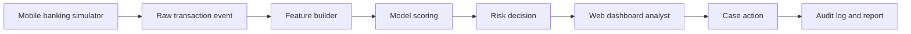
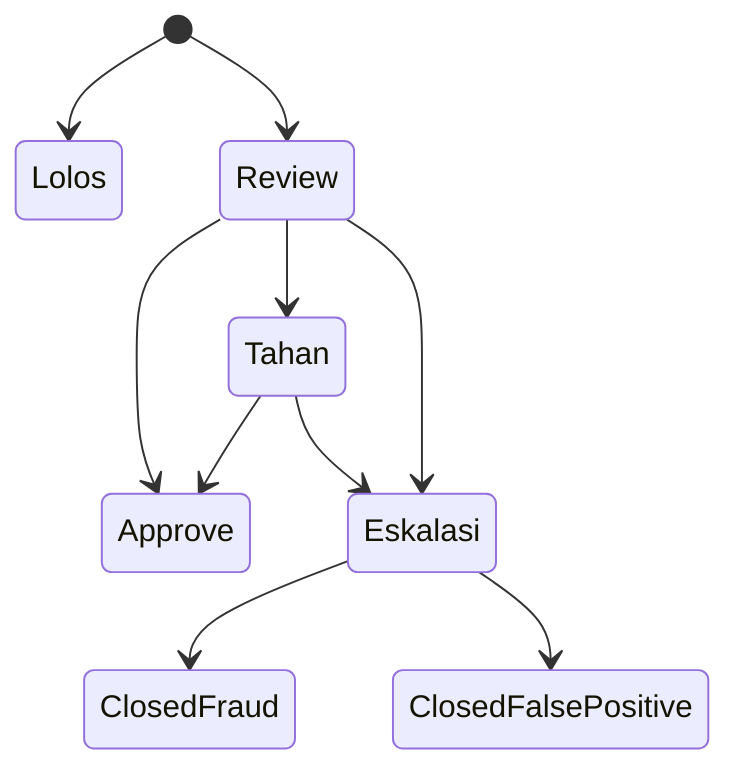
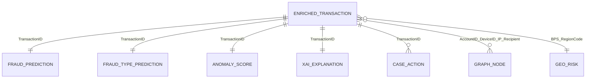
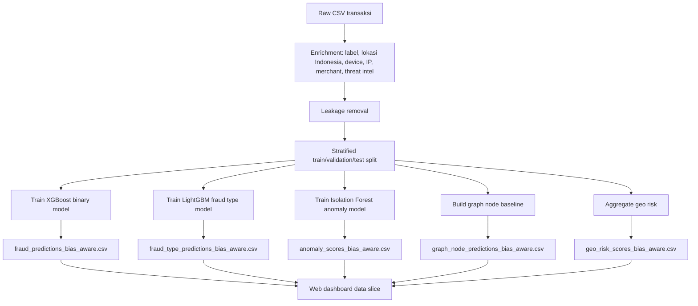
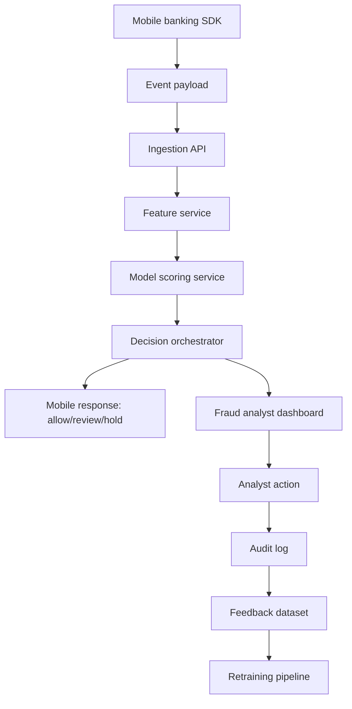

# Blueprint Slicing Data untuk Web Dashboard Amankan.ai FraudGuard

Dokumen ini menjelaskan kebutuhan data lengkap untuk web dashboard fraud analyst, hubungan setiap model dengan dataset yang dibutuhkan, cara slicing output model ke layar dashboard, dan alur data dari mobile banking simulator sampai laporan compliance.

> Prinsip utama: setiap angka, tabel, grafik, dan tombol keputusan di dashboard harus bisa dijawab dengan jelas: datanya dari mana, diproses model apa, outputnya apa, dan dipakai di layar mana.

---

## 1. Tujuan Slicing Data

Slicing data berarti memotong dataset besar dan output model menjadi potongan data kecil yang relevan untuk kebutuhan tiap layar web.

Contoh:

- Layar `Dashboard Monitoring` tidak butuh semua fitur mentah, hanya agregasi: total transaksi, jumlah alert, FPR, F1, threshold, dan top wilayah risiko.
- Layar `Feed Transaksi` butuh daftar transaksi: `TransactionID`, akun sumber, rekening tujuan, nominal, waktu, risk score, risk level, fraud type, dan status analis.
- Layar `Analisis Forensik` butuh satu transaksi detail: device, IP, lokasi, merchant, channel, XAI reason, anomaly score, dan graph relation.
- Layar `Intelligence Report` butuh ringkasan metrik model, audit log, dan status compliance.

Tujuan akhirnya adalah membuat demo end-to-end:



---

## 2. Inventory Dataset dan Output Model

### 2.1 Raw / Enriched Dataset

| File | Peran |
|---|---|
| `data/datasets/bank_transactions_data_edited  - new data.csv` | Dataset transaksi awal. Dipakai sebagai basis transaksi mentah. |
| `data/datasets/fraudguard_enriched_dataset.csv` | Dataset yang sudah diperkaya dengan label fraud, fraud type, lokasi Indonesia, device, IP, merchant, threat intel, dan analyst status. |

Kolom utama `fraudguard_enriched_dataset.csv`:

```text
TransactionID, TransactionDate, PreviousTransactionDate, AccountID,
CustomerAge, CustomerOccupation, RecipientAccountID, TransactionAmount,
AccountBalance, TransactionType, Channel, Location, Location_Original_US,
BPS_RegionCode, DeviceID, IP Address, MerchantID, TransactionDuration,
LoginAttempts, IsFraud, FraudType, ThreatIntel_Flag, AnalystStatus
```

### 2.2 Output Model Bias-Aware

| File | Isi | Dipakai untuk |
|---|---|---|
| `fraud_predictions_bias_aware.csv` | Hasil binary fraud model: probabilitas fraud dan prediksi fraud. | Dashboard stats, feed transaksi, case queue. |
| `fraud_type_predictions_bias_aware.csv` | Prediksi modus fraud multiclass. | Label modus pada feed dan investigasi. |
| `xai_explanations_bias_aware.csv` | Top fitur penyebab fraud dan reason ID. | SHAP/XAI explanation pada detail investigasi. |
| `anomaly_scores_bias_aware.csv` | Skor anomali transaksi. | Indikator review dan model monitoring. |
| `graph_node_predictions_bias_aware.csv` | Skor risiko node graph. | Grafik topologi relasi akun, device, IP, recipient. |
| `geo_risk_scores_bias_aware.csv` | Skor intensitas ancaman wilayah. | Peta ancaman geografis. |
| `model_metrics_bias_aware.json` | Metrik evaluasi model. | Model monitoring, intelligence report, klaim proposal. |
| `model_training_report_bias_aware.md` | Narasi evaluasi dan batasan model. | Technical documentation dan proposal. |

---

## 3. Mapping Model ke Dataset

Bagian ini menjawab format: "model A membutuhkan dataset B dengan ketentuan C".

### 3.1 Model Binary Fraud Detection

| Item | Keterangan |
|---|---|
| Model | XGBoost binary fraud classifier. |
| Tujuan | Memprediksi apakah transaksi fraud atau legitimate. |
| Dataset training | `fraudguard_enriched_dataset.csv` setelah leakage removal dan bias-aware splitting. |
| Target | `IsFraud`. |
| Output model | `fraud_predictions_bias_aware.csv`. |
| File model | `data/models/bias_aware/fraud_binary_bias_aware_pipeline.pkl`. |
| Metrik MVP | F1 81.48%, PR-AUC 96.04%, FPR 0.54%, threshold 0.38. |

Kolom input minimal:

| Kolom | Fungsi |
|---|---|
| `TransactionAmount` | Nominal transaksi. |
| `AccountBalance` | Saldo akun sebelum/saat transaksi. |
| `TransactionType` | Jenis transaksi. |
| `Channel` | Kanal transaksi, misalnya mobile/online. |
| `Location` | Lokasi transaksi. |
| `BPS_RegionCode` | Kode wilayah Indonesia. |
| `DeviceID` | Fingerprint perangkat. |
| `IP Address` | Alamat IP. |
| `MerchantID` | Entitas merchant atau tujuan. |
| `TransactionDuration` | Durasi transaksi. |
| `LoginAttempts` | Jumlah percobaan login. |
| `ThreatIntel_Flag` | Indikator threat intel. |
| `TransactionDate` | Dibuat fitur turunan: jam, hari, malam, weekend. |
| `PreviousTransactionDate` | Dibuat fitur velocity atau jarak antar transaksi. |

Ketentuan training:

- Jangan memasukkan kolom target seperti `IsFraud` ke fitur.
- Jangan memasukkan `FraudType` sebagai fitur untuk binary model karena itu bocor terhadap target.
- Split data harus stratified dan idealnya berbasis waktu/entity untuk mengurangi leakage.
- Resampling hanya boleh dilakukan pada training set, bukan validation/test set.
- Threshold operasional memakai `0.38` dari hasil bias-aware training.

Output yang dibutuhkan web:

```text
TransactionID, IsFraud, xgboost_probability, xgboost_prediction, random_forest_prediction
```

Slicing ke dashboard:

| Output | Dipakai di UI |
|---|---|
| `xgboost_probability` | Fraud risk score, risk badge, urutan prioritas alert. |
| `xgboost_prediction` | Status awal: alert atau non-alert. |
| `IsFraud` | Validasi demo dan evaluasi, bukan ditampilkan sebagai data produksi. |
| `random_forest_prediction` | Baseline comparison di model monitoring. |

---

### 3.2 Model Fraud Type Classification

| Item | Keterangan |
|---|---|
| Model | LightGBM multiclass classifier. |
| Tujuan | Mengklasifikasikan modus fraud: ATO, phishing, identity theft, card cloning, legitimate. |
| Dataset training | Dataset enriched dengan target `FraudType`. |
| Target | `FraudClassTarget` atau `FraudType`. |
| Output model | `fraud_type_predictions_bias_aware.csv`. |
| File model | `data/models/bias_aware/fraud_type_bias_aware_pipeline.pkl`. |
| Metrik MVP | Macro F1 72.23%, Weighted F1 99.08%. |

Kolom output:

```text
TransactionID, FraudClassTarget, IsFraud, PredictedFraudClass, PredictedFraudClassProbability
```

Ketentuan:

- Karena beberapa kelas fraud minoritas masih sangat kecil, output ini dipakai sebagai "clue investigasi", bukan vonis final.
- Untuk proposal, tulis: "fraud type classifier membantu prioritisasi analis, tetapi kelas minoritas butuh data tambahan pada fase pilot".

Slicing ke dashboard:

| Output | Dipakai di UI |
|---|---|
| `PredictedFraudClass` | Label modus fraud pada transaction feed dan forensic page. |
| `PredictedFraudClassProbability` | Confidence modus fraud. |
| `FraudClassTarget` | Evaluasi internal dan report, bukan untuk live UI. |

---

### 3.3 Model Anomaly Detection

| Item | Keterangan |
|---|---|
| Model | Isolation Forest. |
| Tujuan | Memberi sinyal transaksi outlier. |
| Dataset training | Fitur transaksi numerik dan kategorikal yang sudah diproses. |
| Target | Unsupervised, tetapi dievaluasi terhadap `IsFraud`. |
| Output model | `anomaly_scores_bias_aware.csv`. |
| File model | `data/models/bias_aware/isolation_forest_bias_aware_pipeline.pkl`. |
| Metrik MVP | F1 40.82%, Recall 71.43%, ROC-AUC 94.78%. |

Kolom output:

```text
TransactionID, IsFraud, AnomalyScore, AnomalyPrediction
```

Ketentuan:

- Jangan jadikan anomaly model sebagai model utama karena precision masih rendah.
- Pakai sebagai sinyal tambahan untuk status `Review`.
- Cocok untuk menandai transaksi legitimate yang terlihat tidak biasa agar dicek analis.

Slicing ke dashboard:

| Output | Dipakai di UI |
|---|---|
| `AnomalyScore` | Panel forensic "skor anomali". |
| `AnomalyPrediction` | Badge review tambahan. |

---

### 3.4 Graph Analytics / GNN Roadmap

| Item | Keterangan |
|---|---|
| Model | Graph node classifier baseline. |
| Tujuan | Menilai risiko node: akun, recipient, device, IP, merchant, wilayah. |
| Dataset training | Graph node dan graph edge dari transaksi enriched. |
| Output model | `graph_node_predictions_bias_aware.csv`. |
| File model | `data/models/bias_aware/graph_node_bias_aware_baseline.pkl`. |
| Metrik MVP | F1 25.64%, ROC-AUC 72.11%. |

Kolom output:

```text
NodeID, NodeType, FraudRelatedLabel, GraphFraudProbability, GraphFraudPrediction
```

Ketentuan:

- Untuk MVP, sebut sebagai "graph analytics baseline", bukan full GNN production.
- GNN seperti GraphSAGE/R-GCN masuk roadmap pilot setelah tersedia data institusi nyata dan graph yang lebih besar.
- Visual graph di web boleh tetap ada karena fungsinya adalah explainability dan investigasi relasi.

Slicing ke dashboard:

| Output | Dipakai di UI |
|---|---|
| `NodeID` | Label node di grafik topologi. |
| `NodeType` | Warna node: account, recipient, device, IP, merchant, geo. |
| `GraphFraudProbability` | Ukuran/risk label node. |
| `GraphFraudPrediction` | Tanda suspect/non-suspect. |

Kebutuhan tambahan untuk edge:

```text
source_node, target_node, edge_type, transaction_count, total_amount, suspicious_flag
```

Jika edge belum tersedia dari output model, edge bisa dibuat dari dataset enriched:

- `AccountID -> RecipientAccountID`
- `AccountID -> DeviceID`
- `AccountID -> IP Address`
- `AccountID -> MerchantID`
- `AccountID -> BPS_RegionCode`

---

### 3.5 Geo Risk Aggregation

| Item | Keterangan |
|---|---|
| Model/metode | Direct aggregation. |
| Tujuan | Membuat peta intensitas ancaman geografis. |
| Dataset | Dataset enriched dengan `Location`, `Province`, `BPS_RegionCode`, latitude, longitude. |
| Output | `geo_risk_scores_bias_aware.csv`. |
| Metrik | 41 wilayah, bukan model prediksi produksi. |

Kolom output:

```text
BPS_RegionCode, Location, Province, ProvinceCode, Latitude, Longitude,
GeoConfidence, TransactionCount, FraudCount, ThreatIntelCount,
AvgRiskScore, MaxRiskScore, HighRiskTransactionCount, TotalAmount,
FraudAmount, UniqueAccounts, UniqueRecipients, FraudRate,
ThreatIntelRate, ThreatIntensityScore, HighThreatRegionLabel_Seed
```

Ketentuan:

- Di proposal dan UI harus disebut "simulated geo threat intensity".
- Jangan mengklaim sebagai peta fraud nasional riil.
- Peta hanya menunjukkan distribusi risiko pada dataset synthetic/enriched.

Slicing ke dashboard:

| Output | Dipakai di UI |
|---|---|
| `Location` | Nama kota/wilayah pada peta dan ranking top 10. |
| `Latitude`, `Longitude` | Titik peta. |
| `ThreatIntensityScore` | Warna/ukuran hotspot. |
| `HighThreatRegionLabel_Seed` | Label aman/sedang/tinggi/kritis. |
| `TransactionCount`, `FraudCount` | Tooltip wilayah. |

---

### 3.6 XAI / SHAP Explanation

| Item | Keterangan |
|---|---|
| Model/metode | SHAP-ready explanation seed. |
| Tujuan | Menjelaskan alasan transaksi dianggap fraud. |
| Dataset | Output model dan fitur transaksi hasil preprocessing. |
| Output | `xai_explanations_bias_aware.csv`. |

Kolom output:

```text
TransactionID, FraudScore_Probability_Seed, PredictedRiskLevel_Seed,
IsFraud, TopFeature1, TopFeature1Value, TopFeature1Contribution_Seed,
TopReason1_ID, TopFeature2, TopFeature2Value, TopFeature2Contribution_Seed,
TopReason2_ID, TopFeature3, TopFeature3Value,
TopFeature3Contribution_Seed, TopReason3_ID
```

Ketentuan:

- Di UI boleh ditulis "XAI / SHAP-ready", bukan harus mengklaim SHAP production jika nilai kontribusi masih seed/simulasi.
- Top reasons harus ditulis dengan bahasa analis, bukan bahasa model mentah.
- Contoh reason:
  - "Nominal mendekati saldo akun"
  - "IP/device masuk indikator threat intel"
  - "Rekening tujuan muncul pada ring transaksi berisiko"
  - "Jam transaksi tidak sesuai pola historis"

Slicing ke dashboard:

| Output | Dipakai di UI |
|---|---|
| `FraudScore_Probability_Seed` | Skor risiko di detail investigasi. |
| `PredictedRiskLevel_Seed` | Badge risk level. |
| `TopFeature1..3` | Bar XAI. |
| `TopFeature1Contribution_Seed..3` | Panjang bar kontribusi. |
| `TopReason1_ID..3` | Narasi alasan. |

---

### 3.7 Model Monitoring

| Item | Keterangan |
|---|---|
| Sumber | `model_metrics_bias_aware.json`, `model_training_report_bias_aware.md`. |
| Tujuan | Menampilkan performa model dan batasannya. |

Metrik utama:

| Model | Metrik yang ditampilkan | Catatan |
|---|---|---|
| XGBoost binary | Accuracy, precision, recall, F1, ROC-AUC, PR-AUC, FPR, threshold. | Model utama untuk risk scoring. |
| Random Forest | F1, PR-AUC, FPR. | Baseline comparison. |
| LightGBM multiclass | Macro F1, weighted F1, per-class support. | Jangan sembunyikan kelas minoritas. |
| Isolation Forest | Recall, F1, anomaly FPR. | Sinyal review tambahan. |
| Graph baseline | F1, ROC-AUC, PR-AUC. | Roadmap GNN, bukan claim final. |

Slicing ke dashboard:

| Output | Dipakai di UI |
|---|---|
| `false_positive_rate` | KPI false positive rate. |
| `f1_score` | KPI F1 model. |
| `pr_auc` | Model quality pada data imbalance. |
| `selected_threshold` | Threshold badge dan setting. |
| `confusion_matrix` | Chart atau report audit model. |

---

## 4. Kebutuhan Data per Layar Web Dashboard

### 4.1 Dashboard Monitoring

Fungsi layar:

- Melihat ringkasan operasional.
- Melihat sinyal real-time.
- Melihat peta threat intensity.
- Melihat ringkasan model precision.
- Melihat feed transaksi berisiko.

Dataset yang dibutuhkan:

| UI Element | Dataset | Kolom |
|---|---|---|
| Total transaksi | enriched dataset atau fraud predictions | count `TransactionID` |
| Total fraud alert | `fraud_predictions_bias_aware.csv` | count `xgboost_prediction = 1` atau probability >= threshold |
| False positive rate | `model_metrics_bias_aware.json` | `binary_models.xgboost.test.false_positive_rate` |
| F1 model | `model_metrics_bias_aware.json` | `binary_models.xgboost.test.f1_score` |
| Threshold | `model_metrics_bias_aware.json` | `selected_threshold` |
| Peta ancaman | `geo_risk_scores_bias_aware.csv` | `Location`, `Latitude`, `Longitude`, `ThreatIntensityScore` |
| Feed transaksi | joined transaction slice | `TransactionID`, `waktu`, `AccountID`, `RecipientAccountID`, `TransactionAmount`, `risk_score`, `risk_level`, `status` |

Output slice untuk frontend:

```ts
dashboardStats = [
  { label: "Transaksi Dataset", value: "2.537" },
  { label: "Fraud Label", value: "90" },
  { label: "False Positive Rate", value: "0,54%" },
  { label: "F1 Model", value: "81,5%" }
]
```

Ketentuan:

- Gunakan angka MVP, bukan angka produksi.
- Jangan tulis "akurasi 99.7%" di dashboard utama.
- Tuliskan "dataset purwarupa: bias-aware" atau "MVP validation".

---

### 4.2 Feed Transaksi Real-Time

Fungsi layar:

- Menampilkan antrean transaksi.
- Memprioritaskan alert paling berisiko.
- Menjadi pintu masuk ke halaman investigasi.

Dataset yang dibutuhkan:

| Dataset | Kolom |
|---|---|
| `fraudguard_enriched_dataset.csv` | `TransactionID`, `TransactionDate`, `AccountID`, `RecipientAccountID`, `TransactionAmount`, `Location`, `Channel`, `DeviceID`, `IP Address`, `MerchantID`, `AnalystStatus` |
| `fraud_predictions_bias_aware.csv` | `xgboost_probability`, `xgboost_prediction` |
| `fraud_type_predictions_bias_aware.csv` | `PredictedFraudClass`, `PredictedFraudClassProbability` |
| `anomaly_scores_bias_aware.csv` | `AnomalyScore`, `AnomalyPrediction` |
| `xai_explanations_bias_aware.csv` | `TopReason1_ID`, `TopFeature1` |

Join key:

```text
TransactionID
```

Risk level rule:

| Probability | Risk level | UI action |
|---|---|---|
| `>= 0.90` | `kritis` | `Eskalasi` atau `Tahan` |
| `0.70 - 0.89` | `tinggi` | `Investigasi` |
| `0.38 - 0.69` | `sedang` | `Review` |
| `< 0.38` | `rendah` | `Lolos` |

Output slice:

```ts
transactionFeed = [
  {
    id: "TX000424",
    waktu: "2024-11-04 08:11:28",
    pengirim: "AC00262",
    penerima: "REC-RING009",
    jumlah: 10967000,
    risiko: "kritis",
    riskScore: 99.97,
    status: "Eskalasi",
    fraudType: "Account Takeover (ATO)",
    evidence: "TP - model dan label sepakat fraud"
  }
]
```

Ketentuan:

- Gunakan ID anonim, bukan nama orang asli.
- Feed boleh disebut "real-time" sebagai simulasi event stream, tetapi source data MVP tetap CSV/model output.
- Status analis harus masuk akal: `Lolos`, `Review`, `Investigasi`, `Tahan`, `Eskalasi`.

---

### 4.3 Fraud Risk Score

Fungsi layar:

- Menampilkan skor risiko per transaksi.
- Menjelaskan apakah transaksi perlu ditahan atau cukup direview.

Dataset yang dibutuhkan:

| Dataset | Kolom |
|---|---|
| `fraud_predictions_bias_aware.csv` | `xgboost_probability`, `xgboost_prediction` |
| `model_metrics_bias_aware.json` | `selected_threshold` |
| `xai_explanations_bias_aware.csv` | `PredictedRiskLevel_Seed` |

Formula:

```text
risk_score_percent = xgboost_probability * 100
risk_level = bucket(risk_score_percent)
decision = compare(xgboost_probability, selected_threshold)
```

Ketentuan:

- Threshold MVP saat ini: `0.38`.
- Jangan pakai label "percentile" jika sebenarnya probabilitas model.
- Gunakan label "probabilitas fraud" atau "risk probability".

---

### 4.4 Analisis Forensik

Fungsi layar:

- Menjelaskan detail satu transaksi.
- Menggabungkan metadata, skor, XAI, anomaly, dan graph relation.

Dataset yang dibutuhkan:

| Dataset | Kolom |
|---|---|
| `fraudguard_enriched_dataset.csv` | `TransactionID`, `TransactionDate`, `AccountID`, `RecipientAccountID`, `TransactionAmount`, `AccountBalance`, `TransactionType`, `Channel`, `Location`, `BPS_RegionCode`, `DeviceID`, `IP Address`, `MerchantID`, `TransactionDuration`, `LoginAttempts`, `ThreatIntel_Flag` |
| `fraud_predictions_bias_aware.csv` | `xgboost_probability`, `xgboost_prediction` |
| `fraud_type_predictions_bias_aware.csv` | `PredictedFraudClass` |
| `anomaly_scores_bias_aware.csv` | `AnomalyScore` |
| `xai_explanations_bias_aware.csv` | `TopFeature1..3`, `TopFeatureContribution1..3`, `TopReason1_ID..3` |

Output slice:

```ts
selectedInvestigation = {
  id: "TX000424",
  pengirim: "AC00262",
  penerima: "REC-RING009",
  jumlah: 10967000,
  waktu: "2024-11-04 08:11:28",
  metode: "Online debit transfer",
  lokasi: "Tangerang Selatan",
  bpsCode: "3674",
  ip: "167.164.55.0",
  device: "D000234",
  merchant: "M005",
  riskScore: 99.97,
  threshold: 38,
  modelVerdict: "Fraud alert",
  fraudType: "Account Takeover (ATO)",
  anomalyScore: 64.61,
  analystAction: "Eskalasi"
}
```

Ketentuan:

- Tombol aksi tidak boleh terlalu ekstrem untuk MVP.
- Gunakan:
  - `Approve setelah review`
  - `Eskalasi case`
  - `Tahan transaksi`
- Hindari klaim seperti "bekukan semua aset" jika belum ada integrasi core banking.

---

### 4.5 Grafik Topologi Relasi / GNN

Fungsi layar:

- Menunjukkan hubungan antar akun, rekening tujuan, device, IP, merchant, dan wilayah.
- Membantu analis melihat pola mule/ring.

Dataset yang dibutuhkan:

| Dataset | Kolom |
|---|---|
| `graph_node_predictions_bias_aware.csv` | `NodeID`, `NodeType`, `GraphFraudProbability`, `GraphFraudPrediction` |
| enriched dataset | `AccountID`, `RecipientAccountID`, `DeviceID`, `IP Address`, `MerchantID`, `BPS_RegionCode` |

Node construction:

| Node type | Source column |
|---|---|
| Account | `AccountID` |
| Recipient | `RecipientAccountID` |
| Device | `DeviceID` |
| IP | `IP Address` |
| Merchant | `MerchantID` |
| Geo | `BPS_RegionCode` |

Edge construction:

| Edge | Meaning |
|---|---|
| `AccountID -> RecipientAccountID` | Transfer relationship |
| `AccountID -> DeviceID` | Device used by account |
| `AccountID -> IP Address` | Network relation |
| `AccountID -> MerchantID` | Merchant relation |
| `AccountID -> BPS_RegionCode` | Geo relation |

Output slice:

```ts
graphNodes = [
  { id: "A", label: "AC00262", type: "suspect", risk: 99 },
  { id: "B", label: "REC-RING009", type: "recipient", risk: 88 },
  { id: "C", label: "D000234", type: "device", risk: 62 }
]

graphEdges = [
  { from: "A", to: "B", weight: 9, suspicious: true },
  { from: "A", to: "C", weight: 6, suspicious: true }
]
```

Ketentuan:

- Judul yang aman: `Grafik Topologi Relasi`.
- Subtitle yang aman: `Graph analytics baseline untuk investigasi`.
- Jangan klaim full GNN production sampai data graph dan metriknya kuat.

---

### 4.6 SHAP / XAI Explanation

Fungsi layar:

- Menjelaskan alasan transaksi masuk fraud alert.
- Membuat keputusan model bisa dipahami analis dan compliance.

Dataset yang dibutuhkan:

| Dataset | Kolom |
|---|---|
| `xai_explanations_bias_aware.csv` | `TopFeature1`, `TopFeature1Value`, `TopFeature1Contribution_Seed`, `TopReason1_ID`, dan seterusnya |
| `fraud_predictions_bias_aware.csv` | `xgboost_probability` |
| enriched dataset | nilai fitur asli untuk narasi |

Output slice:

```ts
xaiFeatures = [
  {
    name: "Rasio nominal terhadap saldo",
    importance: 1.0,
    impact: "tinggi",
    reason: "Nominal mendekati seluruh saldo akun"
  },
  {
    name: "Threat intel IP/device",
    importance: 0.91,
    impact: "tinggi",
    reason: "IP atau device muncul pada blacklist sintetis"
  }
]
```

Ketentuan:

- Jika kontribusi masih seed, gunakan label `XAI MVP` atau `SHAP-ready`.
- Hindari narasi yang terlalu sci-fi seperti "neural matrix".
- Narasi harus mengarah ke tindakan analis:
  - tahan transaksi
  - eskalasi case
  - minta verifikasi tambahan
  - approve jika false positive

---

### 4.7 Case Management

Fungsi layar:

- Menyimpan tindakan analis.
- Mengubah status transaksi.
- Menjadi feedback untuk evaluasi model berikutnya.

Dataset yang dibutuhkan:

| Dataset | Kolom |
|---|---|
| enriched dataset | `AnalystStatus` |
| fraud predictions | `xgboost_probability`, `xgboost_prediction` |
| XAI output | reasons |
| audit log table | action metadata |

Data audit log yang perlu dibuat:

```text
CaseID, TransactionID, CreatedAt, RiskScore, RiskLevel,
ModelVersion, Threshold, AnalystID, AnalystAction,
ActionReason, PreviousStatus, NewStatus, EvidenceSnapshot,
ReviewTimestamp
```

Status lifecycle:



Ketentuan:

- MVP boleh menyimpan action sebagai dummy state di frontend.
- Untuk proposal, tulis sebagai "case management workflow", bukan integrasi core banking penuh.

---

### 4.8 Intelligence Report

Fungsi layar:

- Membuat laporan harian, audit model, dan compliance log.

Dataset yang dibutuhkan:

| Report | Dataset |
|---|---|
| Daily threat feed | joined transaction feed + case actions |
| Model audit report | `model_metrics_bias_aware.json`, `model_training_report_bias_aware.md` |
| Geo threat report | `geo_risk_scores_bias_aware.csv` |
| Graph audit report | `graph_node_predictions_bias_aware.csv` |
| Compliance log | audit log table |

Output slice:

```ts
reportHistory = [
  { nama: "Model Training Report Bias-aware", tipe: "Evaluasi Model" },
  { nama: "False Positive & Threshold Review", tipe: "Teknis" },
  { nama: "Graph Baseline Node Audit", tipe: "Graph" },
  { nama: "Simulated Geo Threat Intensity", tipe: "Geo" },
  { nama: "Compliance Log MVP Draft", tipe: "Kepatuhan" }
]
```

Ketentuan:

- Jangan tulis "ISO/PCI/SOC certified" pada MVP.
- Gunakan "audit log untuk mendukung OJK/UU PDP".

---

### 4.9 Model Monitoring

Fungsi layar:

- Menunjukkan performa model, threshold, false positive, dan batasan model.

Dataset yang dibutuhkan:

| Dataset | Kolom/object |
|---|---|
| `model_metrics_bias_aware.json` | all model metrics |
| `feature_importance_bias_aware.csv` | top features |
| confusion matrix images | visual evaluasi |
| evaluation curves | ROC, PR curve |

Output slice:

```ts
modelMonitoring = {
  mainModel: "XGBoost binary fraud classifier",
  threshold: 0.38,
  f1: 0.8148,
  prAuc: 0.9604,
  fpr: 0.0054,
  graphBaselineF1: 0.2564,
  limitation: "Graph model masih baseline dan butuh data pilot."
}
```

Ketentuan:

- PR-AUC lebih penting dari accuracy karena data fraud imbalance.
- Tampilkan caveat kelas minoritas untuk multiclass.
- Drift detection boleh disebut roadmap jika belum ada data temporal produksi.

---

### 4.10 Compliance Log

Fungsi layar:

- Menjawab kebutuhan audit: kenapa transaksi ditahan, siapa yang memutuskan, dan berdasarkan bukti apa.

Dataset yang dibutuhkan:

| Data | Kolom |
|---|---|
| Transaction detail | `TransactionID`, `AccountID`, `RecipientAccountID`, `TransactionAmount`, `DeviceID`, `IP Address`, `Location` |
| Model output | risk score, threshold, prediction |
| XAI output | top reasons |
| Analyst action | action, analyst ID, timestamp |
| Report metadata | model version, data version, policy version |

Output minimal:

```text
AuditLogID
TransactionID
RiskScore
RiskLevel
Threshold
TopReasons
ModelVersion
AnalystAction
ActionTimestamp
ComplianceNotes
```

Ketentuan:

- Data personal harus dianonimkan di demo.
- Untuk pilot nyata, tambahkan access control, encryption, consent, retention policy.
- UI harus menyebut "audit log MVP", bukan "sertifikasi compliance".

---

## 5. Join Strategy

Semua output transaksi harus bisa di-join lewat `TransactionID`.



Recommended joined table untuk frontend:

```text
fraudguard_web_transaction_view
```

Kolom:

```text
TransactionID
TransactionDate
AccountID
RecipientAccountID
TransactionAmount
AccountBalance
TransactionType
Channel
Location
BPS_RegionCode
DeviceID
IPAddress
MerchantID
TransactionDuration
LoginAttempts
ThreatIntel_Flag
BinaryFraudProbability
BinaryFraudPrediction
RiskLevel
PredictedFraudClass
PredictedFraudClassProbability
AnomalyScore
AnomalyPrediction
TopFeature1
TopFeature1Contribution
TopReason1
TopFeature2
TopFeature2Contribution
TopReason2
TopFeature3
TopFeature3Contribution
TopReason3
AnalystStatus
RecommendedAction
```

---

## 6. Data Pipeline Lengkap

### 6.1 Offline MVP Pipeline



### 6.2 Future Online / SDK Pipeline



---

## 7. Repository Placement

| Path | Isi |
|---|---|
| `data/datasets/` | Raw dan enriched dataset. |
| `data/model_outputs_bias_aware/` | Output model yang siap dipakai dashboard. |
| `data/models/bias_aware/` | File `.pkl` model/pipeline. |
| `scripts/prepare_bias_aware_fraudguard_data.py` | Menyiapkan data bebas leakage dan bias-aware. |
| `scripts/train_bias_aware_fraudguard_models.py` | Training model dan generate output. |
| `src/pustaka/data-fraudguard.ts` | Slice frontend MVP sementara. |
| `src/app/dasbor/ringkasan/page.tsx` | Dashboard monitoring. |
| `src/app/dasbor/transaksi/page.tsx` | Feed transaksi. |
| `src/app/dasbor/investigasi/page.tsx` | Detail forensik, graph, XAI. |
| `src/app/dasbor/laporan/page.tsx` | Intelligence report. |
| `src/app/dasbor/simulasi/page.tsx` | Mobile banking simulator / SDK demo. |
| `docs/` | Data contract, proposal narrative, technical documentation. |

Untuk prototype sekarang:

```text
CSV/model output -> src/pustaka/data-fraudguard.ts -> UI dashboard
```

Untuk versi lebih matang:

```text
CSV/model output -> JSON/API route -> frontend fetch -> UI dashboard
```

---

## 8. Pseudocode Slicing

### 8.1 Build Web Transaction View

```python
import pandas as pd

tx = pd.read_csv("data/datasets/fraudguard_enriched_dataset.csv")
pred = pd.read_csv("data/model_outputs_bias_aware/fraud_predictions_bias_aware.csv")
ftype = pd.read_csv("data/model_outputs_bias_aware/fraud_type_predictions_bias_aware.csv")
anom = pd.read_csv("data/model_outputs_bias_aware/anomaly_scores_bias_aware.csv")
xai = pd.read_csv("data/model_outputs_bias_aware/xai_explanations_bias_aware.csv")

view = (
    tx.merge(pred, on="TransactionID", how="left")
      .merge(ftype[["TransactionID", "PredictedFraudClass", "PredictedFraudClassProbability"]], on="TransactionID", how="left")
      .merge(anom[["TransactionID", "AnomalyScore", "AnomalyPrediction"]], on="TransactionID", how="left")
      .merge(xai, on="TransactionID", how="left")
)

def risk_level(prob):
    if prob >= 0.90:
        return "kritis"
    if prob >= 0.70:
        return "tinggi"
    if prob >= 0.38:
        return "sedang"
    return "rendah"

view["RiskLevel"] = view["xgboost_probability"].apply(risk_level)
view["RecommendedAction"] = view["RiskLevel"].map({
    "kritis": "Eskalasi",
    "tinggi": "Investigasi",
    "sedang": "Review",
    "rendah": "Lolos",
})

view.to_csv("data/model_outputs_bias_aware/web_transaction_view.csv", index=False)
```

### 8.2 Build Dashboard Stats

```python
metrics = json.load(open("data/model_outputs_bias_aware/model_metrics_bias_aware.json"))

dashboard_stats = {
    "total_transactions": len(view),
    "fraud_labels": int(view["IsFraud"].sum()),
    "fraud_alerts": int((view["xgboost_probability"] >= 0.38).sum()),
    "false_positive_rate": metrics["binary_models"]["xgboost"]["test"]["false_positive_rate"],
    "f1_score": metrics["binary_models"]["xgboost"]["test"]["f1_score"],
    "pr_auc": metrics["binary_models"]["xgboost"]["test"]["pr_auc"],
    "threshold": metrics["binary_models"]["xgboost"]["selected_threshold"],
}
```

### 8.3 Build Investigation Slice

```python
case_id = "TX000424"
case = view[view["TransactionID"] == case_id].iloc[0]

investigation = {
    "id": case["TransactionID"],
    "source": case["AccountID"],
    "recipient": case["RecipientAccountID"],
    "amount": case["TransactionAmount"],
    "risk_score": case["xgboost_probability"] * 100,
    "fraud_type": case["PredictedFraudClass"],
    "anomaly_score": case["AnomalyScore"],
    "top_reasons": [
        case["TopReason1_ID"],
        case["TopReason2_ID"],
        case["TopReason3_ID"],
    ],
}
```

---

## 9. Data Contract untuk Frontend

### 9.1 `DashboardSummary`

```ts
type DashboardSummary = {
  totalTransactions: number;
  fraudLabels: number;
  fraudAlerts: number;
  falsePositiveRate: number;
  f1Score: number;
  prAuc: number;
  selectedThreshold: number;
  framing: "MVP" | "Pilot" | "Production";
};
```

### 9.2 `TransactionFeedItem`

```ts
type TransactionFeedItem = {
  id: string;
  waktu: string;
  pengirim: string;
  penerima: string;
  jumlah: number;
  risiko: "rendah" | "sedang" | "tinggi" | "kritis";
  riskScore: number;
  status: "Lolos" | "Review" | "Investigasi" | "Tahan" | "Eskalasi";
  fraudType: string;
  evidence: string;
};
```

### 9.3 `InvestigationDetail`

```ts
type InvestigationDetail = {
  id: string;
  pengirim: string;
  penerima: string;
  jumlah: number;
  waktu: string;
  metode: string;
  lokasi: string;
  bpsCode: string;
  ip: string;
  device: string;
  merchant: string;
  riskScore: number;
  threshold: number;
  modelVerdict: string;
  fraudType: string;
  anomalyScore: number;
  analystAction: string;
};
```

### 9.4 `XaiFeature`

```ts
type XaiFeature = {
  name: string;
  importance: number;
  impact: "rendah" | "sedang" | "tinggi";
  reason: string;
};
```

### 9.5 `GraphNode` dan `GraphEdge`

```ts
type GraphNode = {
  id: string;
  label: string;
  type: "suspect" | "recipient" | "device" | "ip" | "merchant" | "geo" | "normal";
  risk: number;
};

type GraphEdge = {
  from: string;
  to: string;
  weight: number;
  suspicious: boolean;
};
```

### 9.6 `GeoRiskRegion`

```ts
type GeoRiskRegion = {
  name: string;
  province: string;
  latitude: number;
  longitude: number;
  threatIntensityScore: number;
  transactionCount: number;
  fraudCount: number;
  level: "rendah" | "sedang" | "tinggi" | "kritis";
};
```

---

## 10. Acceptance Criteria per Layar

| Layar | Acceptance Criteria |
|---|---|
| Dashboard Monitoring | Angka KPI berasal dari `model_metrics_bias_aware.json` dan jumlah transaksi dari dataset, bukan hardcoded klaim produksi. |
| Feed Transaksi | Minimal 7 transaksi anonim, sorted by risk score, dengan status analis yang masuk akal. |
| Fraud Risk Score | Menggunakan probabilitas XGBoost dan threshold 0.38. |
| Analisis Forensik | Satu `TransactionID` konsisten dari feed sampai XAI dan graph. |
| Grafik Topologi | Node dan edge berasal dari relasi data, bukan nama random. |
| XAI Explanation | Minimal 3 reason jelas dan bisa dinarasikan analis. |
| Case Management | Tombol action mengubah status atau minimal merekam action dalam audit log demo. |
| Intelligence Report | Mencantumkan batas MVP dan metrik bias-aware. |
| Model Monitoring | Menampilkan F1, PR-AUC, FPR, threshold, dan caveat graph baseline. |
| Compliance Log | Merekam skor, threshold, reason, action, timestamp, dan model version. |

---

## 11. Narasi Demo yang Direkomendasikan

1. Analis membuka `Ringkasan Operasional`.
2. Dashboard menunjukkan dataset MVP: total transaksi, fraud label, FPR, F1, dan threshold.
3. Analis melihat transaksi `TX000424` dengan risiko kritis.
4. Analis membuka `Analisis Forensik`.
5. Sistem menunjukkan metadata transaksi: akun sumber, rekening tujuan, nominal, lokasi, IP, device, merchant.
6. Risk score menunjukkan probabilitas fraud tinggi.
7. XAI menjelaskan alasan: nominal terhadap saldo, threat intel IP/device, dan rekening tujuan ring.
8. Graph menunjukkan hubungan akun dengan recipient, device, IP, merchant, dan geo.
9. Analis memilih `Tahan Transaksi` atau `Eskalasi Case`.
10. Keputusan masuk ke audit log dan dapat muncul di `Intelligence Report`.

---

## 12. Hal yang Harus Dihindari

| Hindari | Ganti dengan |
|---|---|
| "Akurasi model 99.7% produksi" | "F1 MVP 81.48%, PR-AUC 96.04%, FPR 0.54% pada dataset bias-aware." |
| "GNN sudah mendeteksi mule secara sempurna" | "Graph analytics baseline untuk investigasi, GNN sebagai roadmap pilot." |
| "Peta ancaman fraud nasional" | "Simulated geo threat intensity dari enriched dataset." |
| "Sertifikasi ISO/PCI/SOC" | "Audit log MVP yang mendukung kebutuhan OJK/UU PDP." |
| "Freeze semua aset otomatis" | "Tahan transaksi dan eskalasi case sesuai workflow analis." |
| Nama orang asli/publik | Account ID anonim seperti `AC00262`, `REC-RING009`. |

---

## 13. Ringkasan Kebutuhan Dataset per Model

| Model | Dataset yang dibutuhkan | Output | Layar yang memakai |
|---|---|---|---|
| XGBoost Binary Fraud | Enriched transaction features, target `IsFraud` | Fraud probability, prediction, threshold | Dashboard, feed, risk score, forensic, report |
| Random Forest Baseline | Dataset sama seperti XGBoost | Baseline prediction/metric | Model monitoring, report |
| LightGBM Multiclass | Enriched transaction features, target `FraudType` | Predicted fraud class | Feed, forensic, report |
| Isolation Forest | Feature vector tanpa target | Anomaly score | Forensic, model monitoring |
| Graph Baseline | Nodes dan edges dari account, recipient, device, IP, merchant, geo | Node risk | Topology graph, forensic |
| Geo Aggregation | Location, province, BPS code, latitude, longitude, fraud count | Threat intensity score | Geo map, report |
| XAI/SHAP-ready | Model features dan prediction score | Top features and reasons | XAI panel, audit log |

---

## 14. Final Recommendation

Untuk proposal dan demo tahap ini, gunakan framing berikut:

> Web dashboard Amankan.ai menggunakan data slice dari output model bias-aware untuk menampilkan alur fraud detection end-to-end: transaksi dari mobile banking simulator, scoring XGBoost, klasifikasi fraud type, anomaly score, graph relation, XAI reason, case action, dan compliance log. Semua angka yang tampil adalah metrik MVP berbasis synthetic/enriched dataset, bukan klaim produksi bank.

Dengan slicing seperti ini, dashboard menjadi lebih kredibel karena setiap fitur punya data source, model source, dan alasan teknis yang jelas.
